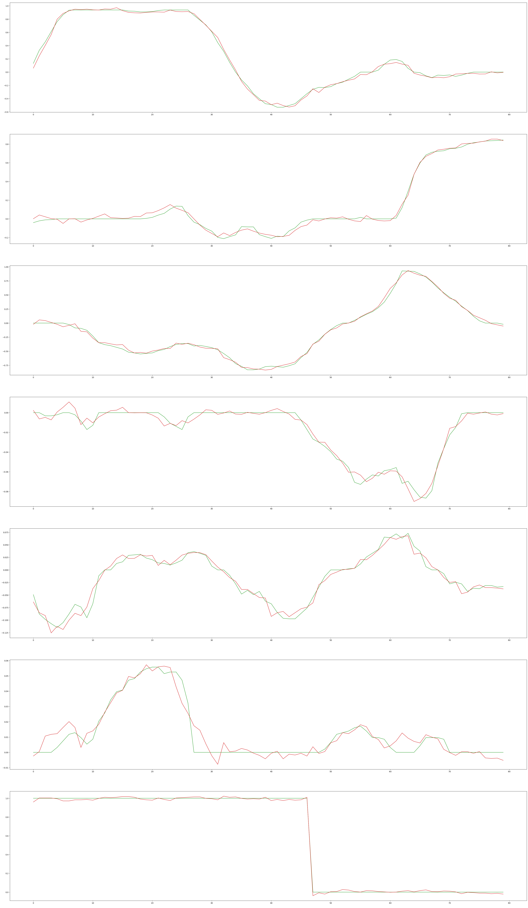

# Demo Training and Evaluation

This directory contains the implementation for training and evaluating EO-1 on the demos25 dataset, a dual-arm robot manipulation dataset for supermarket packing tasks.

## Overview

The demo experiment combines:

- **Robot Control Data**: Demos25 dataset with 25 episodes of dual-arm manipulation
- **Multimodal Data**: RefCOCO dataset for vision-language understanding
- **Interleaved Data**: Combined robot control and multimodal conversations

## Dataset Preparation

### 1. Download Datasets

```bash
# Install Hugging Face CLI if not already installed
pip install huggingface-cli
huggingface-cli login

# Download demos25 dataset
huggingface-cli download --resume-download --local-dir-use-symlinks False --repo-type dataset \
    IPEC-COMMUNITY/demos25 --local-dir ../demo_data/demos25

# Download RefCOCO dataset (if not already available)
# The RefCOCO dataset should be placed in demo_data/refcoco/
```

### 2. Configure Dataset Paths

Update the dataset configuration in `experiments/1_demo/data-demo.yaml`:

```yaml
mm_datasets:
  - json_path: demo_data/refcoco/refcoco.jsonl # jsonl file
    vision_base_path: demo_data/refcoco # base path for vision data files referenced in the JSONL
    sampling_strategy: random:100% # sampling strategy

  - json_path: demo_data/interleaved_demo.jsonl # interleaved data jsonl

# @robot control config
lerobot_datasets:
  - repo_id: demos25
    root: ./demo_data
    # Optional fields:
    # episodes: [1, 2, 3]                                  # specific episodes to load (None = all)
    train_subtask: mix:0.9 # mix sub-task instructions and overall instructions with 90% sub-task
    delta_action: false # train with delta actions
    state_mode: "MEAN_STD" # state normalization mode
    # which camera streams to load
    select_video_keys:
      [
        observation.images.head,
        observation.images.hand_left,
        observation.images.hand_right,
      ]
    # proprioceptive states
    select_state_keys:
      [observation.states.joint.position, observation.states.effector.position]
    # action targets
    select_action_keys: [actions.joint.position, actions.effector.position]
    effector_indices: [14, 15] # indices of effector channels in the flattened action vector
    weight: 1.0 # dataset weight for sampling
```

## Training

### Training Configuration

The training script (`train.sh`) is configured with the following hyperparameters:

- **GPUs**: 8 GPUs for distributed training
- **Batch Size**: 32 per device (total effective batch size: 256)
- **Learning Rates**:
  - backbone: 1e-4
  - merger: 1e-4
  - vision tower: 2e-5
- **Epochs**: 10
- **Chunk Size**: 16 (for sequence processing)
- **Optimization**: AdamW with cosine learning rate scheduling
- **Precision**: BF16 with TF32 enabled

### Start Training

```bash
bash experiments/1_demo/train.sh
```

The training will:

- Use the Qwen2.5-VL-3B-Instruct vision-language model as the base
- Train on both robot control and multimodal data simultaneously
- Save checkpoints every 1000 steps
- Use gradient checkpointing and flash attention for memory efficiency
- Log training progress every 100 steps

## Evaluation

### Run Evaluation

Use the following command to run evaluation:

```bash
# Set the path to your trained checkpoint
ckpt_path=PATH_TO_CHECKPOINT

# Run evaluation
python tools/openloop.py \
  --args.repo_id demos25 \
  --args.root ./demo_data \
  --args.model_path ${ckpt_path} \
  --args.num_step 10 \
  --args.train_subtask True
```

The script will visualize the inference action trajectory. With the following similar result:



## File Structure

```
experiments/1_demo/
├── README.md                # This file
├── train.sh                 # Training script
└── data-demo.yaml           # Dataset configuration
```
